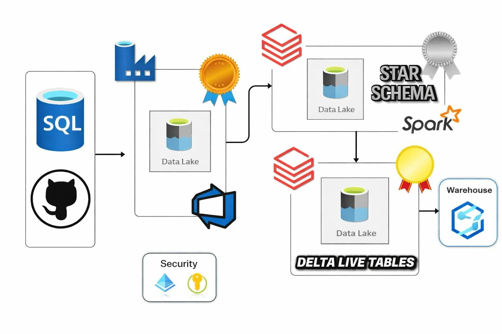

# 🎧 Spotify End-to-End Azure Data Engineering Platform

This project implements a production-style Azure data engineering platform simulating real-world enterprise workflows. It covers ingestion, transformation, streaming, dimensional modeling, orchestration, and CI/CD automation using modern Lakehouse architecture principles.

---

## 🚀 Project Overview

This solution processes Spotify data using scalable Azure-native services and demonstrates:

- Incremental ingestion using Azure Data Factory
- Change Data Capture (CDC) patterns
- Metadata-driven pipelines
- Streaming ingestion with Databricks Auto Loader
- Medallion Architecture (Bronze → Silver → Gold)
- Star Schema modeling with Slowly Changing Dimensions (SCD)
- Delta Live Tables (DLT)
- CI/CD using GitHub and Databricks Asset Bundles

---

# 🏗️ Architecture Diagram

> The architecture integrates Azure SQL, ADF, Azure Data Lake, Databricks, Delta Live Tables, and a Warehouse layer to simulate enterprise-scale data engineering workflows.

---

# 🧰 Technology Stack

| Layer | Technology |
|--------|------------|
| Source System | Azure SQL Database |
| Orchestration | Azure Data Factory |
| Automation | Azure Logic Apps |
| Storage | Azure Data Lake Storage Gen2 |
| Processing | Azure Databricks |
| Streaming | Auto Loader + Spark Structured Streaming |
| Data Format | Delta Lake |
| Data Modeling | Star Schema + SCD |
| Pipeline Framework | Delta Live Tables |
| CI/CD | GitHub + Databricks Asset Bundles |

---

# 🔹 Key Engineering Implementations

## 1️⃣ Incremental Ingestion & CDC
- Implemented watermark-based incremental loading
- Designed Change Data Capture (CDC) logic
- Built backfill mechanisms for historical reprocessing
- Loop-based orchestration for reliability

---

## 2️⃣ Metadata-Driven Pipelines
- Parameterized ADF pipelines
- Dynamic ingestion configurations
- Jinja2-based transformation logic in Databricks
- Reduced hard-coded logic across workflows

---

## 3️⃣ Real-Time Streaming Ingestion
- Implemented Databricks Auto Loader
- Leveraged Spark Structured Streaming
- Efficient scalable ingestion from Data Lake

---

## 4️⃣ Medallion Architecture
- Bronze Layer → Raw ingestion
- Silver Layer → Cleaned and standardized data
- Gold Layer → Aggregated, business-ready datasets

---

## 5️⃣ Dimensional Modeling
- Designed Star Schema model
- Created Fact and Dimension tables
- Implemented Slowly Changing Dimensions (SCD Type handling)

---

## 6️⃣ Delta Live Tables & CI/CD
- Built declarative DLT pipelines
- Implemented Databricks Asset Bundles
- Integrated GitHub-based CI/CD workflows
- Enabled reproducible deployments

---

# 📊 What This Project Demonstrates

✔ Enterprise ingestion patterns  
✔ Batch + Streaming hybrid design  
✔ Lakehouse implementation  
✔ Dimensional modeling best practices  
✔ CI/CD-enabled data engineering  

---

# 📂 Repository Structure
├── linkedService/ # ADF linked services
├── dataset/ # ADF datasets
├── pipeline/ # ADF pipeline definitions
├── src_scripts/ # Databricks transformation logic
├── databricks/files/ # DLT and additional scripts
├── publish_config.json # ADF publish configuration
├── spotify_e2e_architecture.jpg

---

# 🎯 Business Impact Simulation

This project mirrors real-world enterprise data platform scenarios including:

- Ingestion reliability
- Scalable transformations
- Automated orchestration
- Dimensional modeling for BI
- Deployment automation

---

# 🔗 GitHub Repository

https://github.com/Pulkit-Garg15/spotify-e2e-project